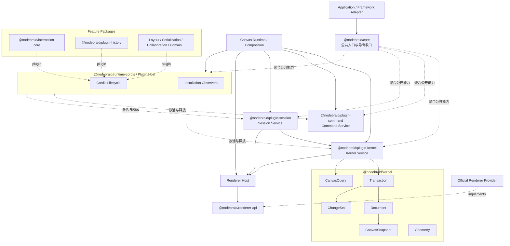

# NodeBraid 阶段性架构基线 v0

> 状态：阶段性设计稿
>
> 日期：2026-08-17
>
> 目的：记录当前已经形成共识的架构边界，并区分稳定原则、候选接口和暂缓事项。

本文不是最终公共 API 说明，也不表示所列模块已经实现。

根目录的 `ARCHITECTURE.md` 描述较完整的目标方向；本文用于约束当前首版实现。两者发生冲突时，应先检查本文中的决策状态，而不是直接把任一文档中的示例签名视为已经冻结的接口。

## 1. 决策状态

本文使用三种状态：

- **稳定原则**：首版实现应当遵守，修改时需要重新评估跨包影响。
- **当前候选**：用于指导实现，但允许被真实代码和测试推翻。
- **暂缓决定**：当前没有足够场景，不提前设计。

架构的目标不是在编码前确定全部细节，而是先固定高成本边界，再通过一条真实的端到端链路验证其余契约。

## 2. 当前定位

NodeBraid 是一个插件化、渲染器无关的流程画布框架。

NodeBraid 将提供多个相互平级的官方 Renderer 包。使用者通常从官方包中选择 Renderer，而不是自行从零实现。架构允许第三方实现 Renderer，但这不是首版的主要使用路径。

当前不指定默认 Renderer，也不把 Konva、SVG、Canvas 2D、PixiJS 或其他实现写入核心依赖。

## 3. 稳定架构骨架



### 3.1 状态归属

| 状态                                                   | 所属模块        | 是否进入 Document History |
| ------------------------------------------------------ | --------------- | ------------------------- |
| Node、Edge、Endpoint、revision                         | Kernel Document | 是                        |
| Selection、Viewport                                    | Session         | 否                        |
| Pointer、Hover、Drag Preview、Connect Preview          | Interaction     | 否                        |
| SVG Element、Canvas Context、Konva/Pixi 对象、命中缓存 | Renderer        | 否                        |

### 3.2 依赖方向

```text
Application / Adapter ────────▶ @nodebraid/core
                                      │ 只做公共收口
                  ┌───────────────────┼────────────────────┐
                  ▼                   ▼                    ▼
       @nodebraid/runtime-cordis  @nodebraid/plugin-kernel  @nodebraid/plugin-command
                                      │
                                      ▼
                               @nodebraid/kernel

@nodebraid/plugin-session ────────▶ @nodebraid/plugin-kernel
          │                    ▶ @nodebraid/kernel
          └───────────────────▶ @nodebraid/runtime-cordis

@nodebraid/renderer-* ────────────▶ @nodebraid/renderer-api
@nodebraid/feature-* ─────────────▶ 所需 Runtime Service 的公开协议
```

约束如下：

1. Kernel 不依赖 Runtime、Renderer、框架适配器和业务插件。
2. `@nodebraid/runtime-cordis` 只提供 Plugin Host 与生命周期，不直接拥有 Kernel、Command 或 Session。
3. Kernel、Command 与 Session 分别由官方 Plugin 提供窄 Runtime Service；Session Plugin 静态依赖 Kernel Service。
4. Renderer 实现依赖 Renderer API，不向外暴露原生对象。
5. 内部包不得反向依赖 `@nodebraid/core`。
6. 包之间不得通过深层 import 访问其他包的私有文件。
7. RxJS 即使被 Runtime 使用，也只属于内部传播实现，不成为公共状态 API。

## 4. Kernel

### 4.1 Graph Model

**状态：概念稳定，字段签名为当前候选。**

Kernel 的持久图模型首版只有 Node 和 Edge。Port 不是顶级实体，而是 Edge Endpoint 上的可选限定信息。

```ts
type NodeId = string & { readonly __brand: 'NodeId' };
type EdgeId = string & { readonly __brand: 'EdgeId' };

interface Point {
  readonly x: number;
  readonly y: number;
}

interface Size {
  readonly width: number;
  readonly height: number;
}

interface EdgeEndpoint {
  readonly nodeId: NodeId;
  readonly portId?: string;
}

interface CanvasNode<TData = unknown> {
  readonly id: NodeId;
  readonly type: string;
  readonly position: Point;
  readonly size?: Size;
  readonly parentId?: NodeId;
  readonly data: TData;
}

interface CanvasEdge<TData = unknown> {
  readonly id: EdgeId;
  readonly type: string;
  readonly source: EdgeEndpoint;
  readonly target: EdgeEndpoint;
  readonly data: TData;
}
```

`type` 是不透明的领域区分值。Kernel 首版不建立 Node Type Registry。

`portId` 缺省时表示连接整个 Node；它存在时不得被 Renderer 静默降级为节点中心。Port 的解析规则由具备对应节点语义的上层能力提供。

### 4.2 Transaction

**状态：稳定原则。**

所有 Document 写入只经过同步、原子的 Transaction：

```text
Command / Public API
        │
        ▼
   Transaction
        │
        ▼
   Private Draft
        │
   校验最终状态
        │
        ▼
Document + Snapshot + ChangeSet
```

约束如下：

1. Transaction 回调本身保持同步，不跨 `await` 持有 Draft。
2. 异步工作在 Command 中完成，最终结果通过同步 Transaction 提交。
3. Transaction 只校验最终 Draft，事务中的临时状态允许暂时不完整。
4. 回调抛错或最终校验失败时，不提交部分状态、不递增 revision、不通知 Observer。
5. 没有净变化时，不递增 revision、不产生 ChangeSet。
6. Kernel 不执行隐式级联删除；Command 必须明确表达关联 Edge 或子 Node 的处理方式。

首版结构校验包括：

- Node ID 与 Edge ID 唯一；
- Edge 引用的 Node 存在；
- `parentId` 引用的 Node 存在；
- Node 父子关系无环；
- NodeBraid 定义的几何数值有效；
- replace 操作不能改变实体 ID。

Kernel 不判断自环、业务连接规则、节点数量限制和业务 Port 是否存在。

### 4.3 TransactionContext

**状态：当前候选。**

```ts
interface TransactionContext {
  readonly query: CanvasQuery;

  addNode(node: CanvasNode): void;
  replaceNode(node: CanvasNode): void;
  removeNode(id: NodeId): void;

  addEdge(edge: CanvasEdge): void;
  replaceEdge(edge: CanvasEdge): void;
  removeEdge(id: EdgeId): void;
}
```

写操作采用严格语义：

- add 已存在实体时失败；
- replace 不存在实体时失败；
- remove 不存在实体时失败；
- 不提供 Document、Map、Draft 或任意内部 Store 句柄；
- 不提供语义含糊的任意 patch 入口。

`canvas.transact()` 当前倾向于作为公开的高级能力。Command 用于组织稳定行为和异步准备，但不作为权限系统。

### 4.4 ChangeSet

**状态：语义稳定，精确 TypeScript 结构为当前候选。**

ChangeSet 保存实体在一次事务前后的状态，使 History 不需要为每种 Command 手写逆操作。

```ts
interface ChangeSet {
  readonly beforeRevision: number;
  readonly revision: number;
  readonly origin?: string;
  readonly commandId?: string;
  readonly changes: readonly GraphChange[];
}

type GraphChange =
  | {
      readonly entity: 'node';
      readonly id: NodeId;
      readonly before: CanvasNode | null;
      readonly after: CanvasNode | null;
    }
  | {
      readonly entity: 'edge';
      readonly id: EdgeId;
      readonly before: CanvasEdge | null;
      readonly after: CanvasEdge | null;
    };
```

同一实体在一次 Transaction 中的多次操作被合并为最初 `before` 与最终 `after`：

```text
add → replace       before: null，after: 最终值
replace → remove    before: 原值，after: null
remove → add        before: 原值，after: 新值
add → remove        没有净变化
```

Undo 逆序恢复 `before`，Redo 正序应用 `after`。

### 4.5 Snapshot 与 Query

**状态：不可变语义稳定，集合与方法签名为当前候选。**

CanvasSnapshot 是运行时快照，不等同于可持久化的 Serialized Document。

当前候选结构：

```ts
interface CanvasSnapshot {
  readonly revision: number;
  readonly nodes: readonly CanvasNode[];
  readonly edges: readonly CanvasEdge[];
}
```

引用规则：

- 同一个 revision 返回同一个 Snapshot 根引用；
- 成功提交产生新的 Snapshot 根引用；
- 没有净变化时保持原引用；
- 未变化实体可以复用旧引用；
- 外部持有的旧 Snapshot 保持稳定；
- Kernel 不负责永久保存所有历史 Snapshot。

公开 Snapshot 暂不暴露原生 `Map`，避免 TypeScript 的 `ReadonlyMap` 在运行时仍可被 `.set()` 修改。按 ID 查询通过 CanvasQuery 完成。

Kernel 对自己定义的 Node、Edge、Point、Size、Endpoint 和公开数组进行防御性复制或冻结，但不递归冻结调用方的任意 `data`。

因为 Kernel 不要求 JSON-safe，也无法安全地通用深拷贝任意 `data`。`data` 按不可变值契约使用，更新时创建新值并通过 replace 提交。

## 5. Canvas Runtime 组合

### 5.1 Runtime 职责

**状态：稳定原则。**

Canvas Runtime 通过 Plugin Graph 组合以下职责，而不是由 `@nodebraid/runtime-cordis` 直接拥有全部能力：

- Kernel Plugin 创建和持有一个 Kernel；
- Plugin Host 通过 Cordis 管理插件依赖、配置、生命周期与释放；
- Command Plugin 提供 Command 注册与执行；
- Session Plugin 持有 Selection 与 Viewport；
- 各能力通过自己的窄 Runtime Service 分发 Snapshot、ChangeSet 与 Session 变化；
- 驱动一个符合 Renderer API 的实例；
- 在 dispose 时释放 Renderer、插件和内部订阅。

Canvas Runtime 不拥有第二份 Document，也不允许多个可写响应式流分别成为权威状态。

### 5.2 Command 与异步

**状态：稳定原则。**

Command 可以异步读取外部数据、计算布局或请求用户输入，但提交阶段保持同步：

```text
async preparation
      │
      ▼
sync Transaction
      │
      ▼
committed ChangeSet
```

首版不提供跨 `await` 的异步 Transaction，也不在 Transaction 期间锁住实时 Document。

### 5.3 Session

**状态：状态边界与首版公开契约已确认。**

初版 Session 只考虑 Selection 和 Viewport：

```ts
interface SessionSnapshot {
  readonly selection: SelectionSnapshot;
  readonly viewport: Viewport;
}

interface SessionService {
  getSnapshot(): SessionSnapshot;
  subscribe(listener: () => void): () => void;
  setSelection(selection: SelectionInput): void;
  clearSelection(): void;
  setViewport(viewport: Viewport): void;
}

interface SelectionInput {
  readonly nodeIds: readonly NodeId[];
  readonly edgeIds: readonly EdgeId[];
}

interface SelectionSnapshot {
  readonly nodeIds: readonly NodeId[];
  readonly edgeIds: readonly EdgeId[];
}

interface Viewport {
  readonly x: number;
  readonly y: number;
  readonly zoom: number;
}
```

Session Plugin 静态依赖 Kernel Service。Session 不经过 Document Transaction，不进入 Document History、Persistence 或 Collaboration。

Selection 是无序集合，重复 ID 规范化为一个成员，Snapshot 中的 NodeId 与 EdgeId 分别按规范 ID 顺序排列；首版没有 primary item。外部设置包含当前 Kernel View 中不存在的实体时整次拒绝且保持原状态。Document 删除已选实体后，Session 依据每个 Kernel Commit 的 `after` View 按 Session 转换顺序清理无效 Selection；这属于派生视图状态同步，不是 Kernel 的隐式级联，也不产生 History。

Session Snapshot 不带独立 revision。同一逻辑状态保持根引用，只有 Selection 或 Viewport 变化时才创建新根，并复用未变化的子引用。Session subscriber 不接收参数，通过 `getSnapshot()` 读取状态；重入更新使用同步广度优先队列，使同轮 subscriber 观察同一个 Snapshot。

Viewport 首版只表达平移与缩放：

```text
screenX = worldX × zoom + x
screenY = worldY × zoom + y
```

`x` 与 `y` 使用逻辑屏幕单位，浏览器中对应 CSS pixel；`devicePixelRatio` 与物理像素缩放属于 Renderer。底层只要求数值有限且 `zoom > 0`，不硬编码或静默应用产品级缩放上下限。

## 6. Renderer 边界

### 6.1 官方 Provider

**状态：Renderer 协议与 Runtime adapter 已实现；具体 Provider 暂缓。**

Renderer API 与 Renderer Provider 分包。NodeBraid 可以逐步提供多个官方 Provider：

```text
@nodebraid/renderer-api
@nodebraid/renderer-*
```

具体 Provider 平级存在，核心架构不指定默认实现。首版只需要选择一个真实 Provider 验证协议，该选择不构成长期默认承诺。

### 6.2 跨边界数据

**状态：稳定原则。**

Renderer 只能接收或输出由 NodeBraid 定义的数据结构：

```text
Runtime → Renderer
    CanvasView reset
    CanvasCommit
    SessionSnapshot

Renderer → Runtime
    RendererInput
    HitResult
```

禁止跨边界传递：

- DOM Event、PointerEvent 等原生事件对象；
- HTMLElement、SVGElement；
- Konva Node、Pixi DisplayObject、Canvas Context；
- Renderer 内部 Store、Stage、Scene 或操作句柄；
- `getUnderlyingObject()` 一类通用逃生接口。

Renderer 负责绘制、坐标转换、命中测试和原始输入标准化；Interaction 负责选择、拖动、框选、连线和 Command 调用。

### 6.3 文档更新协议

**状态：已实现。**

```ts
type RenderDocumentUpdate =
  | {
      readonly type: 'reset';
      readonly view: CanvasView;
    }
  | {
      readonly type: 'commit';
      readonly commit: CanvasCommit;
    };
```

- 首次挂载或重新同步使用 `reset`；
- 正常事务提交使用 `commit`；
- commit 中 before、after 与 ChangeSet revision evidence 必须一致且连续；
- Renderer 可以使用 ChangeSet 增量更新，也可以从 commit.after 整图重建；
- Document 更新与 Session 更新保持为两个显式通道。

RendererInput 已冻结为 Pointer、Wheel 与 Keyboard 的最小 union；HitResult
只表达 Canvas、Node、Edge、Port 与 World Point。两者只包含 ID、坐标、按键
状态和显式 NodeBraid 语义，不复制完整原生事件或后端对象。

## 7. Plugin 与副作用

### 7.1 Plugin 最小能力

**状态：稳定方向，具体接口暂缓。**

首版 Plugin 只需要能够：

- 使用公开 Runtime Service；
- 注册 Command；
- 订阅 ChangeSet 或 Session；
- 读取 Query；
- 注册与生命周期绑定的 Disposable。

Command Service 由官方 `@nodebraid/plugin-command` 通过普通 Runtime Service 提供，但不形成独立架构层。定义 handler 的 Feature Plugin 通过自己的静态 Service Binding 获取 Kernel、Session 或其他依赖，Command Service 不提供动态 Service lookup。Node Type Registry、Port Registry、Effect Registry、UI Registry 和 Renderer Contribution Registry 当前都不是必需基础设施。

### 7.2 提交后副作用

**状态：稳定原则。**

Transaction 只保证 Document 状态的同步原子提交。Persistence、业务 API、日志和其他副作用在提交后由 Observer 异步执行。

失败处理由具体插件负责显式暴露、重试、补偿或让用户重新提交修正。首版不实现通用 Effect Journal、自动补偿事务或全局 Reconciler。

## 8. 首版模块范围

**状态：当前已实现。**

首版只计划形成以下发布包：

```text
packages/
├── kernel/             @nodebraid/kernel
├── plugin-kernel/      @nodebraid/plugin-kernel
├── plugin-command/     @nodebraid/plugin-command
├── session-api/        @nodebraid/session-api
├── plugin-session/     @nodebraid/plugin-session
├── renderer-api/       @nodebraid/renderer-api
├── plugin-renderer/    @nodebraid/plugin-renderer
├── runtime-cordis/     @nodebraid/runtime-cordis
├── interaction-api/    @nodebraid/interaction-api
├── plugin-interaction/ @nodebraid/plugin-interaction
├── plugin-history/     @nodebraid/plugin-history
├── renderer-svg/       @nodebraid/renderer-svg
├── preset-basic/       @nodebraid/preset-basic
└── core/               @nodebraid/core，公共收口
```

`preset-basic` 已在完整 Runtime 组合形成稳定重复证据后进入实现。它接受显式 Renderer Factory，通过 Child Installation 组合 Kernel、Command、Session、Renderer、Interaction 与 History，等待全部 child active，并保持 Host、Diagnostics、Provider 与 sibling Plugin 由应用显式拥有。真实 SVG canonical example 与 Chromium 测试验证完整可视链路，但 preset package 本身不依赖 SVG 或 DOM。

## 9. 实施阶段

### 阶段 1：Kernel

```text
Node / Edge
→ Transaction
→ Snapshot
→ Query
→ ChangeSet
→ 可逆性测试
```

### 阶段 2：Runtime

```text
Cordis 生命周期
→ Command
→ Observer
→ Session
→ Renderer Host
```

### 阶段 3：真实 Renderer

```text
首次完整渲染
→ 输入标准化
→ 命中测试
→ ChangeSet 增量更新
```

### 阶段 4：Interaction 与 History（已形成首版闭环）

```text
选择
→ 拖动
→ 提交
→ Undo / Redo
→ 完整闭环
```

## 10. 首版验收链路

首版以真实行为而不是包数量作为完成标准：

```text
创建 Canvas
→ 添加两个 Node
→ 添加一条 Edge
→ Renderer 显示 Snapshot
→ 选择并拖动一个 Node
→ Transaction 提交位置
→ Renderer 消费 ChangeSet
→ History 执行 Undo
→ History 执行 Redo
→ dispose 后释放全部监听与资源
```

## 11. 暂缓事项

以下事项不在当前阶段展开：

- 其他 Renderer Provider；
- 默认 Renderer；
- React、Vue Adapter；
- Layout 与 Edge Routing；
- Serialized Document 与 JSON-safe 约束；
- Persistence 协议；
- 完整业务 Validation 系统；
- Yjs Collaboration；
- Domain Plugin 规范；
- Port 顶级实体或 Port Registry；
- Renderer 热切换；
- 多 View 共享一个 Document；
- Effect Journal；
- 异步 Transaction；
- Renderer Capability 协商系统；
- 产品 UI Contribution 系统。

未来引入 Yjs 时，应避免同时存在两个合并权威。当前预期方向是由 Y.Doc 负责协作合并，CanvasSnapshot 作为本地不可变投影；本地 revision 只表示本地投影版本，不作为跨客户端版本号。该方向暂不进入首版实现。

## 12. 尚未冻结的问题

以下问题仍应当在对应阶段实现前，通过真实用例决定：

1. 其他 Renderer Provider 的优先顺序；
2. 其他 Runtime Plugin Service 是否需要进一步收窄公开表面；
3. `data` 不可变约定是否需要额外的开发期诊断能力。

这些问题没有在本文中被遗漏，而是被有意保留到具有实现证据时再决定。
